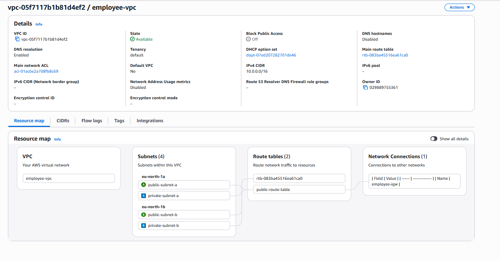

# AWS Employee Management System

## Project Overview

This project demonstrates the design and implementation of a highly available 3-tier web application architecture on AWS.

The goal of this project is to gain hands-on experience with:

- AWS Networking
- Compute
- Security
- Infrastructure Design
- Database Architecture
- Linux Administration
- Cloud Documentation

---

## Current Architecture

### Presentation Layer (Web Tier)
- Amazon EC2 Web Server
- Hosted in a Public Subnet
- Public IP Address assigned
- Security Group allows HTTP (80) and SSH (22)

### Application Layer
- Planned for future implementation
- Will host application logic and APIs
- Will reside in a Private Subnet

### Data Layer
- Dedicated Database EC2 Instance
- Hosted in a Private Subnet
- No Public IP Address
- MySQL/Aurora port 3306 restricted to the Web Tier Security Group

---

## AWS Services Used

- Amazon VPC
- Amazon EC2
- Security Groups
- Internet Gateway
- Route Tables
- Public Subnets
- Private Subnets
- Network ACLs
- Amazon Linux 2023

---

## Skills Demonstrated

- VPC Design and Configuration
- Public and Private Subnet Architecture
- Route Table Configuration
- Security Group Management
- EC2 Deployment
- Linux Administration
- Web Server Hosting
- Database Tier Isolation
- Infrastructure Documentation
- GitHub Project Documentation

---

## Network Architecture

| Component | Configuration |
|------------|---------------|
| VPC | 10.0.0.0/16 |
| Public Subnet | 10.0.1.0/24 |
| Private Subnet A | 10.0.3.0/24 |
| Internet Gateway | Attached |
| Route Table | Public Internet Route Configured |
| Web Server | employee-web-1 |
| Database Server | employee-db-1 |

---

## Future Improvements

### Phase 2
- Install MySQL on employee-db-1
- Create Employee Database
- Connect Web Tier to Database Tier
- Store employee records in MySQL

### Phase 3
- Deploy Application Load Balancer
- Deploy Auto Scaling Group
- Create Launch Templates

### Phase 4
- Migrate Database Tier to Amazon RDS
- Implement Multi-AZ Architecture
- Enable Automated Backups

### Phase 5
- Configure CloudWatch Monitoring
- Create CloudWatch Dashboards
- Configure SNS Alerts

### Phase 6
- Register Custom Domain
- Configure Route 53
- Enable HTTPS using AWS Certificate Manager

---

# Architecture Screenshots

## VPC Overview

## Subnets Overview

## Public Route Table

## Security Group Rules

## EC2 Web Server Running

## Website Hosted on EC2

## Web and Database Instances

## Database Server Networking

## Database Security Group

### Flask Application Running

