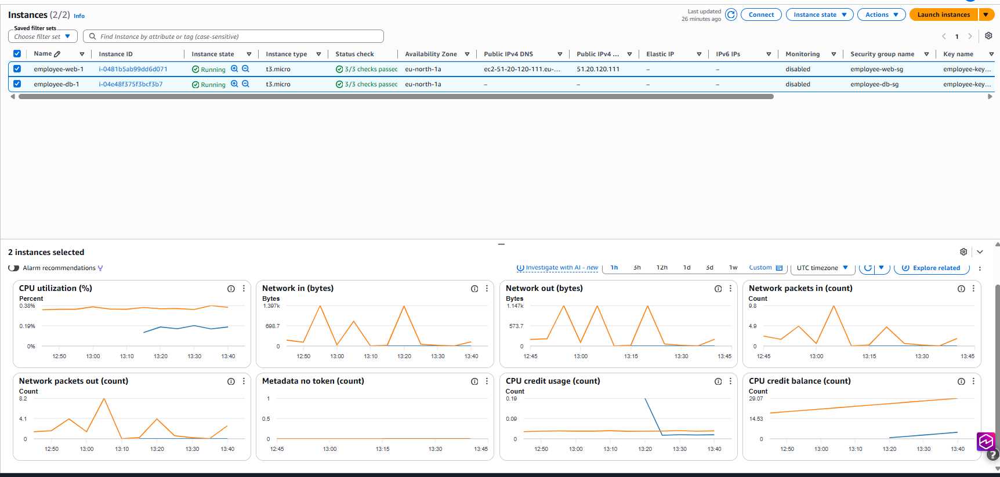

# AWS Employee Management System

## Project Overview

This project demonstrates the design and implementation of a multi-tier web application architecture on AWS using custom networking, EC2 instances, security groups, and infrastructure best practices.

The project currently consists of a functional web tier and an isolated database tier, with database integration planned as the next phase.

The goal of this project is to gain hands-on experience with:

* AWS Networking
* AWS Compute Services
* Cloud Security
* Infrastructure Design
* Database Architecture
* Linux Administration
* Web Application Hosting
* Infrastructure Documentation

---

## Current Architecture

### Presentation Layer (Web Tier)

* Amazon EC2 Web Server
* Hosted in a Public Subnet
* Public IPv4 Address Assigned
* Flask Web Application Running
* Security Group Allows HTTP (80), Flask (5000), and SSH (22)

### Application Layer

* Planned for Future Implementation
* Will Host Application Logic and APIs
* Will Reside in a Private Subnet

### Data Layer

* Dedicated Database EC2 Instance
* Hosted in a Private Subnet
* No Public IP Address
* Isolated from the Internet
* MySQL Port (3306) Restricted to the Web Tier Security Group

---

## AWS Services Used

* Amazon VPC
* Amazon EC2
* Security Groups
* Internet Gateway
* Route Tables
* Public Subnets
* Private Subnets
* Network ACLs
* Amazon Linux 2023

---

## Skills Demonstrated

* VPC Design and Configuration
* Public and Private Subnet Architecture
* Route Table Configuration
* Security Group Management
* EC2 Deployment
* Linux Administration
* Flask Application Deployment
* Web Server Hosting
* Database Tier Isolation
* Infrastructure Documentation
* GitHub Project Documentation

---

## Network Architecture

| Component        | Configuration                    |
| ---------------- | -------------------------------- |
| VPC              | 10.0.0.0/16                      |
| Public Subnet    | 10.0.1.0/24                      |
| Private Subnet A | 10.0.3.0/24                      |
| Internet Gateway | Attached                         |
| Route Table      | Public Internet Route Configured |
| Web Server       | employee-web-1                   |
| Database Server  | employee-db-1                    |

---

## Current Status

✅ Custom VPC Created

✅ Public Subnet Created

✅ Private Subnet Created

✅ Internet Gateway Attached

✅ Route Tables Configured

✅ Security Groups Configured

✅ EC2 Web Server Deployed

✅ EC2 Database Server Deployed

✅ Flask Application Running on EC2

✅ Public Access to Web Tier Verified

🔄 Database Connectivity Testing In Progress

⏳ MySQL Installation Pending

⏳ Database Integration Pending

---

## Future Improvements

### Phase 2 – Database Integration

* Install MySQL on employee-db-1
* Create Employee Database
* Connect Web Tier to Database Tier
* Store Employee Records in MySQL

### Phase 3 – Scalability

* Deploy Application Load Balancer
* Deploy Auto Scaling Group
* Create Launch Templates

### Phase 4 – Managed Database Services

* Migrate Database Tier to Amazon RDS
* Implement Multi-AZ Architecture
* Enable Automated Backups

### Phase 5 – Monitoring and Observability

* Configure Amazon CloudWatch
* Create CloudWatch Dashboards
* Configure SNS Alerts

### Phase 6 – Production Readiness

* Register Custom Domain
* Configure Amazon Route 53
* Enable HTTPS with AWS Certificate Manager

---

# Architecture Screenshots

## VPC Overview

## Subnets Overview

## Public Route Table

## Security Group Rules

## EC2 Web Server Running

## Website Hosted on EC2

## Web and Database Instances

## Database Server Networking

## Database Security Group

## Flask Application Running

