# AWS Employee Management System

## Project Overview

This project demonstrates the design and implementation of a secure multi-tier web application architecture on AWS.

The project was built to gain hands-on experience with:

* AWS Networking
* Compute Services
* Security
* Infrastructure Design
* Database Administration
* Linux Administration
* Cloud Architecture
* GitHub Documentation

The architecture follows AWS best practices by separating the web and database tiers into different subnets and securing communication through Security Groups.

---

# Architecture Overview

## Presentation Layer (Web Tier)

* Amazon EC2 Web Server
* Hosted in a Public Subnet
* Public IPv4 Address Assigned
* Flask Web Application Hosted on EC2
* Security Group allows:

  * HTTP (80)
  * SSH (22)

## Application Layer

* Planned for future implementation
* Will host application logic and APIs
* Will reside in a Private Subnet

## Data Layer

* Dedicated Database EC2 Instance
* Hosted in a Private Subnet
* No Public IP Address
* MariaDB Installed
* Employee Database Created
* Database access restricted through Security Groups

---

# AWS Services Used

* Amazon VPC
* Amazon EC2
* Amazon Linux 2023
* Security Groups
* Internet Gateway
* NAT Gateway
* Route Tables
* Public Subnets
* Private Subnets
* Network ACLs
* Elastic IP Addresses
* MariaDB

---

# Skills Demonstrated

* VPC Design and Configuration
* Public and Private Subnet Architecture
* Security Group Management
* Route Table Configuration
* Internet Gateway Configuration
* NAT Gateway Deployment
* EC2 Deployment and Administration
* Linux Administration
* SSH Bastion / Jump Host Access
* Database Tier Isolation
* MariaDB Installation and Configuration
* Web Application Hosting
* Infrastructure Documentation
* GitHub Project Documentation

---

# Network Architecture

| Component        | Configuration  |
| ---------------- | -------------- |
| VPC              | 10.0.0.0/16    |
| Public Subnet    | 10.0.1.0/24    |
| Private Subnet   | 10.0.3.0/24    |
| Internet Gateway | Attached       |
| NAT Gateway      | Configured     |
| Web Server       | employee-web-1 |
| Database Server  | employee-db-1  |
| Database         | employee_db    |
| Database Engine  | MariaDB 10.5   |

---

# Current Status

✅ Custom VPC Created

✅ Public and Private Subnets Configured

✅ Internet Gateway Attached

✅ Route Tables Configured

✅ Security Groups Configured

✅ Web Server Deployed (employee-web-1)

✅ Database Server Deployed (employee-db-1)

✅ Flask Application Running on EC2

✅ NAT Gateway Configured

✅ Private Subnet Internet Access Configured

✅ MariaDB Installed on Database Server

✅ employee_db Database Created

✅ employees Table Created

✅ Secure SSH Access from Web Tier to Database Tier

🔄 Flask-to-Database Integration In Progress

---

# Future Improvements

## Phase 3 – Application Integration

* Connect Flask Application to MariaDB
* Create Employee Registration Form
* Store Employee Records in Database
* Retrieve Employee Records from Database

## Phase 4 – High Availability

* Deploy Application Load Balancer
* Deploy Auto Scaling Group
* Create Launch Templates

## Phase 5 – Managed Database

* Migrate Database Tier to Amazon RDS
* Implement Multi-AZ Architecture
* Enable Automated Backups

## Phase 6 – Monitoring

* Configure CloudWatch Monitoring
* Create CloudWatch Dashboards
* Configure SNS Alerts

## Phase 7 – Production Readiness

* Register Custom Domain
* Configure Route 53
* Enable HTTPS using AWS Certificate Manager

---

# Architecture Screenshots

## VPC Overview

## Subnets Overview

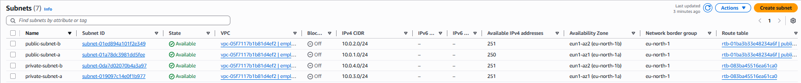

## Public Route Table

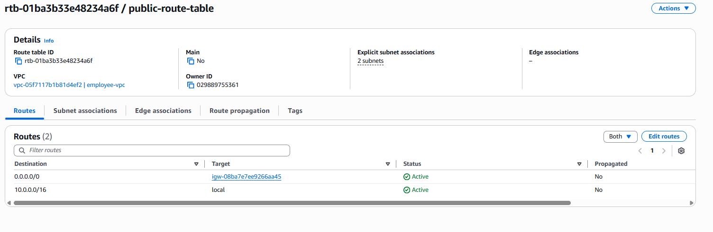

## Security Group Rules

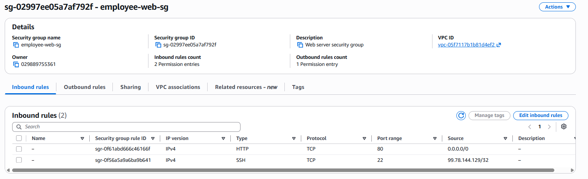

## EC2 Web Server Running

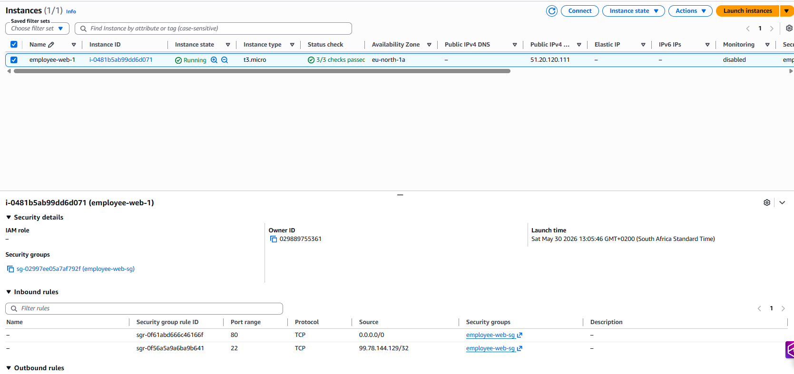

## Website Hosted on EC2

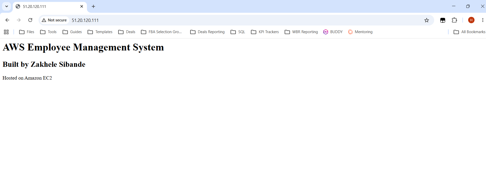

## Web and Database Instances

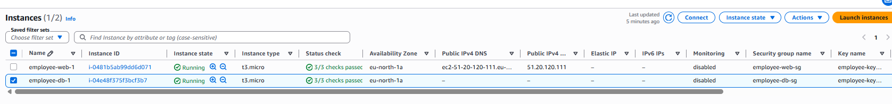

## Database Server Networking

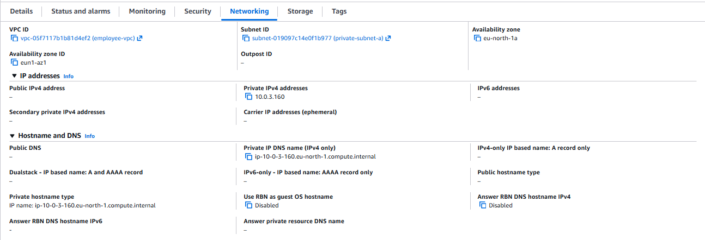

## Database Security Group

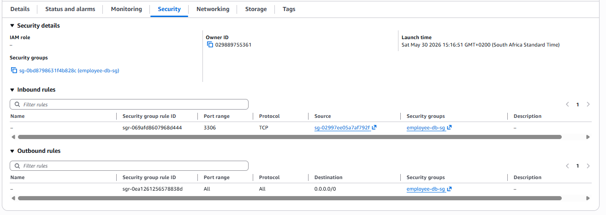

## Flask Application Running

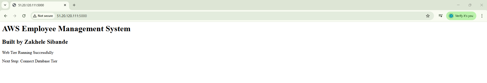

## NAT Gateway

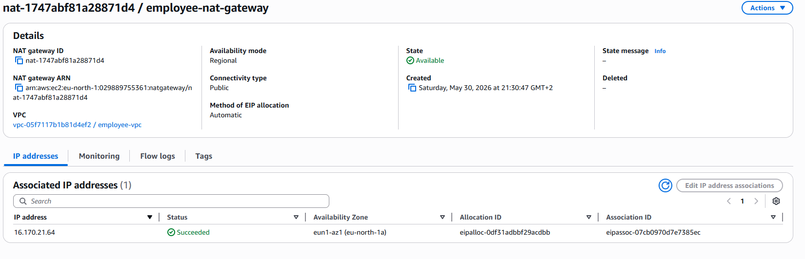

## Private Route Table with NAT Gateway

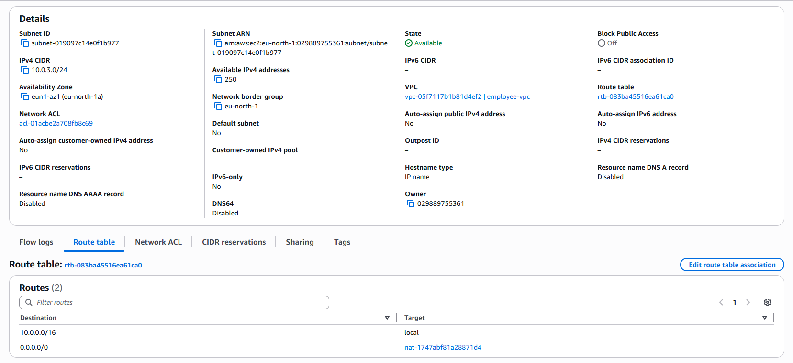

## Database Created

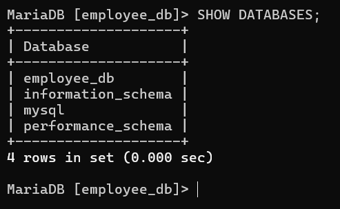

## Employees Table Created

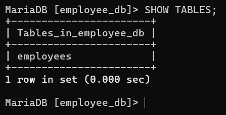

---

# Author

**Zakhele Sibande**

AWS Cloud & Infrastructure Portfolio Project

Built to demonstrate practical AWS Solutions Architect and Cloud Engineering skills.
